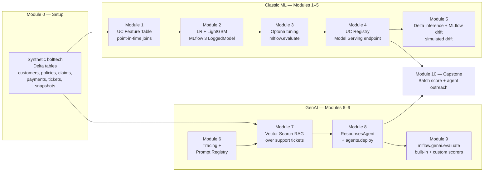

# MLflow 3 + Databricks Churn Workshop for bolttech

A 60-minute hands-on workshop that teaches **MLflow 3 on Databricks** end-to-end through a single insurtech use case: predict which bolttech policyholders are likely to lapse next cycle, then use a GenAI agent to draft personalized retention outreach. Covers the full breadth of the MLflow 3 surface — `LoggedModel`, autologging, tracing, prompt registry, evaluation, and the `ResponsesAgent` flavor — anchored on real Databricks platform primitives (Feature Engineering in UC, UC Model Registry, Model Serving, Delta inference tables with MLflow-tracked drift detection, Vector Search, Agent Framework). Every notebook runs top-to-bottom on a fresh UC-enabled workspace with zero hand-editing.

---

## Architecture



---

## Prerequisites

A workspace and a few permissions:

- [ ] **Databricks workspace** with Unity Catalog enabled (AWS, Azure, or GCP).
- [ ] **Databricks Runtime** — Serverless base environment is the primary target; **DBR 17.3 LTS ML** is the validated classic-cluster fallback.
- [ ] **Foundation Model APIs** enabled (pay-per-token). The workshop uses `databricks-claude-haiku-4-5` and `databricks-gte-large-en`.
- [ ] **Vector Search** enabled (Modules 6 & 7).
- [ ] **Permissions:**
  - `CREATE CATALOG` on the metastore (first run only — to create `bolttech_workshop`). If you don't have it, ask a workspace admin to run the first setup cell once; everything else only needs `USE CATALOG bolttech_workshop` + `CREATE SCHEMA`.
  - `CREATE MODEL` / `CREATE MODEL VERSION` in your per-user schema.
  - Ability to create Model Serving endpoints (Modules 4, 8) and Vector Search endpoints / indexes (Modules 6, 7).
- [ ] **Rate-limit headroom** — FMAPI is 200K input / 20K output tokens per minute per workspace. For a group session, scope to ≤10 participants on a single workspace.
- [ ] **Roughly 60 minutes** of clock time. The workshop budget breakdown is in [`PLAN.md`](./PLAN.md) §4.
- [ ] **(Optional) Production-monitoring dashboard** — to populate the GenAI experiment's **Overview** charts (Usage / Quality / Tool calls), set `MONITORING_WAREHOUSE_ID` in `config/workshop_config.py` to a SQL warehouse ID. This turns on **Unity Catalog trace storage** (bound in Module 0, before the first trace) and requires the workspace's trace-storage preview features. Off by default — the core workshop and the Traces tab work without it.

---

## Quickstart

Two paths — pick one based on how you want to consume the workshop:

### A) Interactive walk-through (default — participant / workshop format)

1. **Clone the repo into Databricks.**
   In your workspace → **Repos** → **Add repo** → paste the git URL of this repo. It lands at `/Workspace/Users/<your-email>/mlflow3-databricks-churn-workshop`.

2. **Open the setup notebook.**
   `setup/00_setup_and_synthetic_data.py`. Attach to **Serverless** or a **DBR 17.3 LTS ML** cluster. Run all cells (Run → Run All, or Ctrl+Shift+Enter cell by cell).

3. **Walk through the modules in order.**
   `modules/01_feature_engineering` → `modules/02_experiment_tracking` → … → `modules/10_capstone`. Each module's `README.md` lists prerequisites and expected runtime. Run all cells in each notebook.

4. **(Optional) Reset.**
   When you're done playing, run `scripts/reset_workshop.py` to tear down catalog/schema/endpoints/indexes/registered models so you can re-run from scratch.

> Notebooks read identifiers from `config/workshop_config.py` — **don't edit catalog or table names inside the notebooks.** To target a different catalog (e.g. an existing one in your own workspace), set the **`WORKSHOP_CATALOG`** env var — no code edit needed — or change the one default in `config/workshop_config.py`. The catalog defaults to `bolttech_workshop`; `CREATE CATALOG` is best-effort, so the same script also runs against a catalog you already have.

### B) Deploy the end-to-end validation Job from a notebook (no local CLI required)

After cloning the repo into your workspace via Git folders, open [`scripts/deploy_workshop_job.py`](./scripts/deploy_workshop_job.py) and Run All. It uses the **Databricks Python SDK** (not the CLI — which is restricted on Serverless `%sh`) to:

1. Resolve the workspace path of the cloned repo from `dbutils.notebook.entry_point.getDbutils().notebook().getContext().notebookPath()`.
2. Build a 10-task Job spec mirroring `resources/workshop_e2e_job.yml`, with notebook tasks pointing at your actual Git-folder paths.
3. **Idempotently create-or-update** the `MLFlow Workshop e2e job` (looks up by name; updates in place if it exists). Safe to re-run after pulling repo changes.
4. Print the Job URL so you can monitor in the Workflows UI.
5. (Optional cell) Trigger a run via `w.jobs.run_now(...)` — returns immediately with the run URL while the chained 10-task Job executes in the background.

This is the **fastest path** for customer demos because the user never has to leave the Databricks UI or install anything locally. Uses workspace auth automatically; no env vars or `databricks auth login` step.

### C) Deploy the e2e validation Job from your local terminal

Same bundle as Option B, but driven from your own machine — useful for CI / repeatable team deployments.

```bash
# One-time: install/update the Databricks CLI
# https://docs.databricks.com/aws/en/dev-tools/cli/install

databricks auth login --host https://<your-workspace>.cloud.databricks.com

# From the repo root:
databricks bundle validate                # sanity-check the bundle
databricks bundle deploy --target dev     # syncs notebooks + creates the Job
databricks bundle run workshop_e2e        # triggers a run; CLI tails progress
```

After `deploy` (B or C), the Job appears in the **Workflows** UI as **`[dev <your-user>] MLFlow Workshop e2e job`**. Click **Run now** there if you'd rather trigger from the UI than the CLI. Expected wall-clock: **~40-60 min** (M4 endpoint cold-start + M8 `agents.deploy()` dominate). Bundle setup details + tear-down (`databricks bundle destroy --target dev`) are in [`databricks.yml`](./databricks.yml).

---

## Module index

| # | Module | Notebook | Est. time | Key concepts |
|---|---|---|---|---|
| 0 | Setup & synthetic data | `setup/00_setup_and_synthetic_data.py` | ~3 min | UC catalog/schema; seeded synthetic insurtech tables; CDF enabled |
| 1 | Feature engineering | `modules/01_feature_engineering/01_feature_engineering.py` | ~4 min | `FeatureEngineeringClient`; UC feature tables; `FeatureLookup(timestamp_lookup_key=...)` |
| 2 | Experiment tracking | `modules/02_experiment_tracking/02_experiment_tracking.py` | ~5 min | **MLflow 3 `LoggedModel` entity**; `mlflow.autolog`; `name=` replaces `artifact_path=`; `models:/<model_id>` URI |
| 3 | Tuning & evaluation | `modules/03_tuning_and_eval/03_tuning_and_eval.py` | ~5 min | Optuna nested runs; `mlflow.evaluate(model_id=...)`; custom business metric via `make_metric` |
| 4 | UC registry + Model Serving | `modules/04_registry_and_serving/04_registry_and_serving.py` | ~7-8 min | `mlflow.set_registry_uri('databricks-uc')`; `@champion`/`@challenger` aliases; **background-provisioning pattern** for endpoint cold-start |
| 5 | Production monitoring | `modules/05_monitoring/05_monitoring.py` | ~2-3 min | `scipy.stats` drift (KS + χ²) + `mlflow.evaluate` per window; simulated drift on `payment_failures_60d`; Delta drift table + MLflow time-series + Databricks SQL Alerts |
| 6 | Tracing + Prompt Registry | `modules/06_tracing_and_prompts/06_tracing_and_prompts.py` | ~3 min | `mlflow.openai.autolog()`; `@mlflow.trace`; `register_prompt` w/ `{{var}}`; `@production` alias |
| 7 | RAG over support tickets | `modules/07_rag_churn_insights/07_rag_churn_insights.py` | ~6-8 min | `create_delta_sync_index` w/ managed embeddings; traced RAG chain |
| 8 | Retention agent + deploy | `modules/08_retention_agent/08_retention_agent.py` | ~9 min | `mlflow.pyfunc.ResponsesAgent`; OpenAI Agents SDK; `resources=[...]`; **actual `agents.deploy()`** |
| 9 | GenAI evaluation | `modules/09_genai_evaluation/09_genai_evaluation.py` | ~5-6 min | `mlflow.genai.evaluate`; `Correctness`, `Safety`, `Guidelines` scorers; prompt iteration loop |
| 10 | Capstone | `modules/10_capstone/10_capstone.py` | ~3-5 min | End-to-end: batch score → top-10 → deployed agent → drafted emails |

**Total participant runtime budget: ≤60 min.** Detailed budget per module in [`PLAN.md`](./PLAN.md) §4. Actual observed runtimes are tracked in [`VERIFICATION.md`](./VERIFICATION.md).

---

## Troubleshooting

### 1. `ModuleNotFoundError: No module named 'config.workshop_config'`
The `sys.path.append(...)` at the top of each notebook resolves the repo root from the notebook's path. This fails if the notebook is run outside a Databricks Repos / Git folders context. **Fix:** clone the repo via the Databricks Repos UI (not by uploading files individually), and re-run the import cell.

### 2. `RESOURCE_DOES_NOT_EXIST` when querying the Module 4 serving endpoint
The endpoint provisioned but is still in `NOT_READY` state. **Fix:** wait 2-5 more minutes (cold-starts vary). The Module 4 final cell has a `Wait.result(timeout=timedelta(minutes=15))` — re-run that cell if it timed out.

### 3. `PERMISSION_DENIED` on `CREATE CATALOG`
You don't have `CREATE CATALOG` on the metastore. **Fix:** ask an admin to run `CREATE CATALOG IF NOT EXISTS bolttech_workshop` once. From then on, you only need `USE CATALOG bolttech_workshop` + `CREATE SCHEMA`. The setup notebook's `IF NOT EXISTS` clauses handle the rest.

### 4. Module 7 Vector Search index never reaches `ONLINE`
The VS endpoint may have failed to provision. **Fix:** check the endpoint state in the Catalog Explorer UI under **Compute → Vector Search**. If it's in `FAILED`, delete it and re-run Module 6 cell 2 to create a fresh one. If it stays `PROVISIONING` for >15 min, you've likely hit a workspace VS endpoint quota — contact your workspace admin.

### 5. `agents.deploy()` fails with `unrecognized keyword argument`
The `databricks-agents` SDK version on your workspace has a different signature than what we passed. **Fix:** Module 8 already wraps the call in `try/except TypeError` and retries with the minimal call signature. If that also fails, run `%pip show databricks-agents` to verify the version and check the [agent-framework docs](https://docs.databricks.com/aws/en/generative-ai/agent-framework/deploy-agent) for current signature.

### 6. GenAI experiment **Overview** tab shows `Traces: 0` / `Errors: 0`
The Overview dashboards (Usage / Quality / Tool calls) read from **Unity Catalog trace storage**, not the default control-plane store — so the Traces *tab* can be full while the Overview *charts* read 0. **Fix:** set `MONITORING_WAREHOUSE_ID` in `config/workshop_config.py` to a SQL warehouse ID **before running Module 0** (a UC trace destination can only bind to a trace-free experiment, so it must be set up before the first trace). If the experiment already has traces, delete it and re-run from Module 0. See [Store MLflow traces in Unity Catalog](https://docs.databricks.com/aws/en/mlflow3/genai/tracing/trace-unity-catalog).

---

## Glossary — MLflow 3 terminology

| Term | What it means |
|---|---|
| **`LoggedModel`** | First-class MLflow 3 entity for a trained model. Has its own `model_id`, lifecycle, and URI (`models:/<model_id>`). Replaces MLflow 2's run-scoped model artifacts. |
| **Run** | A single execution of training / evaluation code. Still useful for grouping params and metrics, but is no longer the unit of model identity. |
| **Trace** | A structured log of an LLM call (or any decorated function), with inputs, outputs, latency, tokens, and sub-spans. Captured automatically via `mlflow.openai.autolog()` / `@mlflow.trace`. |
| **Prompt** | A versioned template registered in the **Prompt Registry**. Uses `{{variable}}` syntax. Loaded by name, version, or alias (`prompts:/name@production`). |
| **Scorer** | A judge in `mlflow.genai.evaluate(...)` that grades each row of an eval. Built-ins include `Correctness`, `Safety`, `Guidelines`, `RetrievalGroundedness`. Custom scorers via `@scorer`. |
| **`ResponsesAgent`** | MLflow 3's canonical 2026 agent flavor (`mlflow.pyfunc.ResponsesAgent`). Built on the OpenAI Responses API schema. Replaced `ChatAgent`. |
| **Resource declaration** | `DatabricksServingEndpoint(...)` / `DatabricksVectorSearchIndex(...)` passed to `log_model(resources=[...])`. Tells Databricks Model Serving to inject creds so the deployed agent can reach those Databricks resources. |
| **Alias** (registered model) | A named pointer to a specific model version: `@champion`, `@challenger`. Downstream code uses `models:/name@alias` so promoting a new version doesn't require code changes. |

---

## Repo map

```
mlflow3-databricks-churn-workshop/
├── README.md                # This file — start here
├── PLAN.md                  # Full curriculum plan + locked technical decisions
├── VERIFICATION.md          # Per-notebook verification log
├── LICENSE                  # Apache 2.0
├── CONTRIBUTING.md          # How to contribute back
├── requirements.txt         # Pinned versions (also %pip installed inside each notebook)
├── databricks.yml           # Databricks Asset Bundle entry point (Quickstart B)
├── resources/
│   └── workshop_e2e_job.yml # Multi-task Job resource — chains M1 → M10 on Serverless
├── config/
│   └── workshop_config.py   # Single source of truth — catalog/schema/endpoint names
├── setup/
│   └── 00_setup_and_synthetic_data.py
├── modules/
│   ├── 01_feature_engineering/
│   ├── 02_experiment_tracking/
│   ├── 03_tuning_and_eval/
│   ├── 04_registry_and_serving/
│   ├── 05_monitoring/
│   ├── 06_tracing_and_prompts/
│   ├── 07_rag_churn_insights/
│   ├── 08_retention_agent/  # 08_retention_agent.py + agent.py
│   ├── 09_genai_evaluation/ # 09_genai_evaluation.py + eval_dataset.py
│   └── 10_capstone/
├── docs/
│   ├── architecture.md      # Mermaid diagrams
│   ├── instructor_guide.md  # Pacing notes for facilitators
│   └── research_log.md      # Citation appendix
└── scripts/
    ├── deploy_workshop_job.py  # In-workspace notebook — deploys bundle + Job (Quickstart B)
    └── reset_workshop.py       # Tear down catalog/schema/endpoints for a clean re-run
```

---

## License

Apache 2.0 — see [LICENSE](./LICENSE).

Built by Databricks Field Engineering. Use, fork, adapt. Bug reports and PRs welcome per [CONTRIBUTING.md](./CONTRIBUTING.md).
