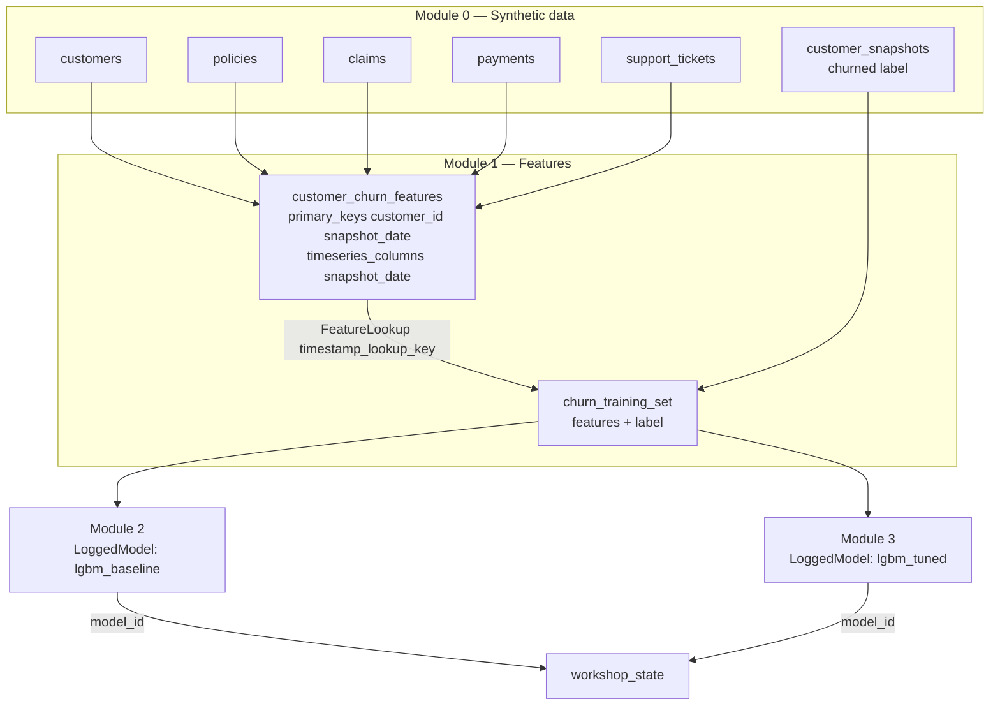
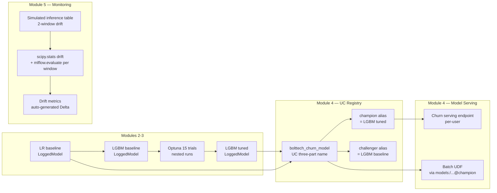
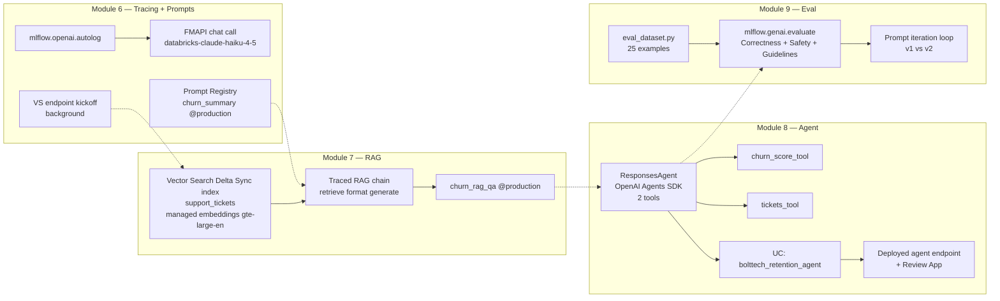
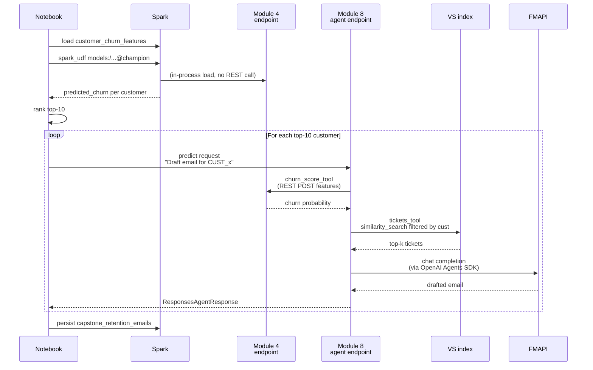

# Architecture

End-to-end view of what the workshop builds and how the pieces connect across the 10 modules.

---

## 1. End-to-end data flow

The single source of truth for inter-notebook handoffs is the `workshop_state` Delta table (small key/value table written via `MERGE INTO`).

---

## 2. Classic ML pipeline (Modules 2-5)

The **background-provisioning pattern** in Module 4 fires `serving_endpoints.create(...)` non-blocking, batch-scores via `mlflow.pyfunc.spark_udf` while the endpoint warms up, then `.result(timeout=...)`s at the end. Same pattern in Module 8 for the agent endpoint.

---

## 3. GenAI pipeline (Modules 6-9)

Module 8's agent tools wire into Module 4's serving endpoint and Module 7's VS index respectively (via the `resources=[...]` declaration on `log_model`, which gives the deployed endpoint auto-auth to those Databricks resources).

---

## 4. End-to-end serving (Module 10 capstone)

---

## 5. Cross-cutting state

- **`workshop_state` Delta table** (per-user schema). Keys persisted: `lgbm_baseline_model_id`, `lgbm_tuned_model_id`, `lgbm_tuned_run_id`, `lgbm_tuned_test_auc`, `churn_endpoint_name`, `churn_model_uc_name`, `churn_champion_version`, `agent_model_id`, `agent_uc_name`, `agent_uc_version`, `agent_endpoint_name`, `agent_endpoint_url`, `agent_review_app_url`. Reading: `spark.table(STATE_TABLE).filter("key = '<k>'").select("value").first()[0]`.
- **MLflow experiment** (`/Users/<user>/mlflow3_workshop`). Every run, LoggedModel, trace, and eval result lands here.
- **Per-user UC schema** (`bolttech_workshop.churn_<sanitized_user>`). All Delta tables, the feature table, the inference table, and the workshop state table live here. Registered models also reference this schema in their three-part names.
- **Per-user serving endpoints** (`bolttech_churn_<user>`, plus the auto-named agent endpoint from `agents.deploy()`).
- **Per-user VS endpoint and index** (`bolttech_vs_<user>`, `<schema>.support_tickets_index`).
